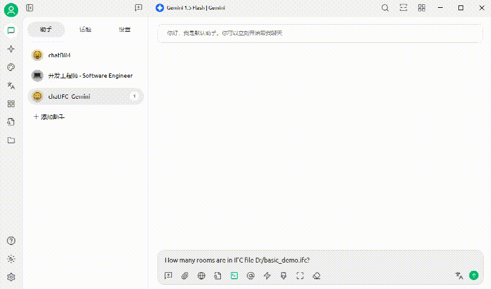

# ifcMCP
An MCP server that enables LLM agents to talk with IFC (Industry Foundation Classes) files

## Star History

[](https://www.star-history.com/#smartaec/ifcMCP&Date)

# related packages
1. ifcopenshell
2. FastMCP

# supported tools
1. get_entities
2. get_named_property_of_entities
3. get_entity_properties
4. get_entity_location
5. get_entities_in_spatial
6. get_openings_on_wall
7. get_space_boundaries
8. create_ifc_model
9. set_ifc_units
10. create_ifc_project
11. create_model_context
12. create_body_context
13. create_ifc_site
14. create_ifc_bridge
15. create_ifc_bridge_part
16. assign_ifc_aggregation

# creation tools
All model creation and update tools are file-based. They do not pass a live Python `model` object between MCP calls. Instead, each tool accepts a `file_path`, reopens the IFC file, updates it, and writes it back.

1. `create_ifc_model`: create a blank IFC file with initialized header metadata
2. `create_ifc_project`: add an `IfcProject` entity
3. `set_ifc_units`: assign length and area units such as `inch` and `square inch`
4. `create_model_context`: create the top-level geometric representation context
5. `create_body_context`: create the `Body` subcontext under the model context
6. `create_ifc_site`: create an `IfcSite` entity
7. `create_ifc_bridge`: create an `IfcBridge` entity
8. `create_ifc_bridge_part`: create an `IfcBridgePart` such as `SUBSTRUCTURE` or `PIER`
9. `assign_ifc_aggregation`: connect parent-child hierarchy by GlobalId

# how to use it
1. clone this repo
2. install packages needed: [ifcopenshell](https://docs.ifcopenshell.org/ifcopenshell-python/installation.html), FastMCP
3. start command line interface in folder `ifcMCP`, and run the command `python server.py`
4. open your favorite LLM tools and setup MCP server with the following configuration:
```
{
  "mcpServers": {
    "ifcMCP-server": {
      "name": "ifcMCP",
      "type": "streamableHttp",
      "description": "A simple MCP server to handle ifc files",
      "isActive": true,
      "tags": [],
      "baseUrl": "http://127.0.0.1:8000/mcp"
    }
  }
}
```

# usage sequence for creating a basic bridge model
Use the tools in this order when building a new IFC model from scratch:

1. `create_ifc_model(file_path)`
2. `create_ifc_project(file_path, name)`
3. `set_ifc_units(file_path, length_unit_name="inch", area_unit_name="square inch")`
4. `create_model_context(file_path, context_type="Model")`
5. `create_body_context(file_path, parent_context_type="Model", context_identifier="Body", target_view="MODEL_VIEW")`
6. `create_ifc_site(file_path, name="Project Site")`
7. `create_ifc_bridge(file_path, name="Sample Bridge")`
8. `create_ifc_bridge_part(file_path, predefined_type="SUBSTRUCTURE", name="Substructure")`
9. `create_ifc_bridge_part(file_path, predefined_type="PIER", name="Pier")`
10. `assign_ifc_aggregation(file_path, parent_globalId=<IfcProject>, child_globalIds=[<IfcSite>])`
11. `assign_ifc_aggregation(file_path, parent_globalId=<IfcSite>, child_globalIds=[<IfcBridge>])`
12. `assign_ifc_aggregation(file_path, parent_globalId=<IfcBridge>, child_globalIds=[<Substructure>])`
13. `assign_ifc_aggregation(file_path, parent_globalId=<Substructure>, child_globalIds=[<Pier>])`

The `create_*` tools return the created entity `globalId`. Reuse those returned `globalId` values in later `assign_ifc_aggregation` calls.

# example workflow
For a structure similar to `example_code/ifc_exporter.py`, the high-level workflow is:

1. create the file with `create_ifc_model`
2. create the project with `create_ifc_project`
3. set units with `set_ifc_units`
4. create geometric contexts with `create_model_context` and `create_body_context`
5. create the site, bridge, substructure, and pier entities
6. aggregate them into the hierarchy `IfcProject -> IfcSite -> IfcBridge -> IfcBridgePart(SUBSTRUCTURE) -> IfcBridgePart(PIER)`



# contributors
Jia-Rui Lin (lin611#tsinghua.edu.cn)

Department of Civil Engineering, Tsinghua University

Key Laboratory of Digital Construction and Digital Twin led by Prof. Peng Pan

# cite us
```
@article{JRLin2506,
	author = {Jia-Rui Lin and Peng Pan},
	title = {ifcMCP: Enabling LLM agents to talk with IFC files},
	year = {2025}
}
```